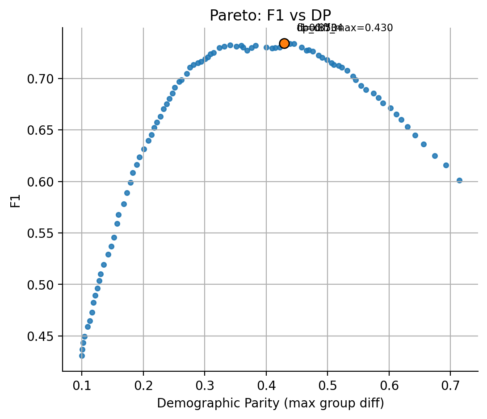

# Census Income Classifier

[](https://github.com/Vanargo/Census-Income-Classifier/actions/workflows/ci.yml)

## Overview
This project predicts whether an individual's annual income exceeds $50K based on census data (UCI Adult dataset).
The pipeline includes:
- exploratory Data Analysis (EDA);
- training and evaluation of multiple ML models;
- fairness assessment across sensitive groups;
- model explainability with SHAP.

The goal is to demonstrate a full Data Science workflow: from raw dataset to deployed model artifacts, with careful attention to fairness and transparency.

---

## Project Structure
- data/
    - raw/ # Исходные данные (Adult dataset)
    - processed/ # Обработанные данные (train/test splits и пр.)
    - artifacts/ # Модели и артефакты обучения/тестирования
        - lgb_best.joblib # (estimator) лучший LGBM без препроцессинга
        - X_test_enc.npz # закодированный тест (для голых моделей)
        - fairness_thresold_scan.csv # экспорт скан-ия порогов (fariness)
    - models/
    - model_best.joblib # (pipeline) лучший пайплайн=препроцессинг+модель
- notebooks/
    - 01_data_loading_and_eda.ipynb
    - 02_modeling.ipynb
    - 03_fairness_and_explainability.ipynb
    - artifacts/ # Артефакты, сохраненные из ноутбуков
    - models/
- src/
    - models/
        - infer.py # CLI интерфейса (см. раздел 'How to run unference')
    - utils.py # вспомогательные функции
- tests/
    - conftest.py # фикстуры для unit-тестов
    - test_infer_cli.py # smoke-тесты CLI
    - test_infer_func.py # smoke-тесты функций инференса
    - test_preprocessing.py # smoke-тест препроцессора
    - fixtures/
        - minidata.csv
        - micro_model.joblib
- reports/
    - figures_01/ # ключевые графики EDA
        - eda_correlation_numeric.png
        - eda_numeric_distributions.png
    - figures_02/ # ключевые графики моделинга
        - roc_curve.png
        - pr_curve.png
        - calibration_curve.png
        - confusion_matrix.png
        - feature_importance_lgbm.png
        - feature_importance_xgb_gain.png
    - figures_03/ # fairness/explainability
        - Pareto_f1_vs_dp.png
- requirements.txt
- requirements-dev.txt
- environments.yml
- README.md

---

## Dataset
- **Source:** [UCI ML Repository - Adult dataset](https://archive.ics.uci.edu/ml/datasets/adult)
- **Files used:**
    - `data/raw/adult.data` (training data, ~32K rows)
    - `data/raw/adult.test` (test data, ~16K rows)

The dataset contains demographic and employment-related features, such as age, education, occupation, sex, and hours-per-week, with a binary label:
- '<=50K'
- '>50K'

---

## Pipeline

### 1. Exploratory Data Analysis (EDA)
Notebook: `01_data_loading_and_eda.ipynb`
- loads raw dataset;
- cleans missing values and formats categorical variables;
- explores distributions, correlations, and potential outliers;
- saves processed dataset to `data/processed/adult_eda.csv` and `.parquet`.

### 2. Modeling
Notebook: `02_modeling.ipynb`
- splits data into train/test;
- applies unified preprocessing ('ColumnTransformer' with encoders/scalers);
- trains multiple models: Logistic Regression, Decision Tree, Random Forest, XGBoost, LightGBM;
- performs hyperparameter tuning (RandomizedSearch);
- compares models with AUC, F1, precision, recall, accuracy;
- saves the best model (LightGBM) and artifacts (features, metrics, predictions).

### 3. Fairness & Explainability
Notebook: `03_fairness_and_explainability.ipynb`
- loads best model and artifacts;
- defines sensitive features (sex, age, education);
- evaluates fairness metrics (Demographic Parity, Equalized Odds);
- explores thresholds trade-offs with Pareto curves;
- applies 'ThresholdOptimizer' for post-processing fairness mitigation;
- explains predictions using SHAP (global and local).

---

## Installation
### Option 1 (рекомендуется, conda):
```bash
conda env create -f environment.yml
conda activate census_ds2
```
### Option 2 (через pip)
```bash
python - <<'PY'
from pathlib import Path
p = Path('requirements.txt')
data = p.read_text(encoding='utf-16')
p.write_text(data, encoding='utf-8')
print('requirements.txt переписан в UTF-8')
PY

pip install -r requirements.txt
```
# для запуска unit-тестов установите dev-зависимости:
```bash
conda install --file requirements-dev.txt -c conda-forge
```

## Results
### Model Performance
| Model     | AUC   | F1    | Precision | Recall | Accuracy |
|-----------|-------|-------|-----------|--------|----------|
| LGBM_best | 0.93  | 0.72  | 0.79      | 0.66   | 0.80     |
| XGB_es    | 0.93  | 0.72  | 0.79      | 0.66   | 0.88     |
| RF_best   | 0.92  | 0.69  | 0.81      | 0.59   | 0.81     |
| LogReg    | 0.91  | 0.67  | 0.74      | 0.61   | 0.74     |

### Fairness
Pareto curve shows trade-off between F1 and Demographic Parity;
Example: 

### Explainability
SHAP summary plots hightlight top features (education, occupation, hours-per-week, age).

## Testing

Unit-тесты реализованы в папке `tests/`. Они включают:
- smoke-тесты CLI (`test_infer.py`);
- smoke-тесты функций инференса (`test_infer_func.py`);
- smoke-тест препроцессора (`test_preprocessing.py`).

Запуск всех тестов:
```bash
pytest -q
```

## Limitations
- sensitive attributes analyzed: sex, age, education only;
- some metric inconsistencies detected (accuracy = precision in some rows);
- fairness post-processing may reduce overall accuracy;
- inference script реализован как рабочий CLI (`src/models/infer.py`), поддерживает опции `--proba`, `--threshold`, `also-label`.

## Roadmap
- [ ] Fix metric bug in results table;
- [ ] fill `requirements.txt` with pinned versions;
- [x] expand `infer.py` into a full CLI tool;
- [x] save EDA and modeling plots into `reports/figures_01/` and `reports/figures_02/`;
- [x] add unit tests for preprocessing and inference;
- [ ] export HTML reports of notebooks.

## Usage

### Run Notebooks
Execute Jupyter notebooks in sequence:
1. `notebooks/01_data_loading_and_eda.ipynb`.
2. `notebooks/02_modeling.ipynb`.
3. `notebooks/03_fairness_and_explainability.ipynb`.

### Inference (after expanding `infer.py`)
Run predictions on new data:
```bash
# Инференс из уже закодированных признаков (X_test_enc.npz) и обученной модели:
python - <<'PY'
import numpy as np
import scipy.sparse as sp
from joblib import load
from pathlib import Path

model_p = Path("data/artifacts/lgb_best.joblib")
x_enc_p = Path("data/artifacts/X_test_enc.npz")
out_p = Path("predictions.csv")

X = sp.load_npz(x_enc_p)
clf = load(model_p)
proba = clf.predict_proba(X)[:, 1]
np.savetxt(out_p, proba, delimiter=",", header="proba", comments="")
print(f"Saved: {out_p.resolve()}")
PY
```

## How to run inference

After training, the best pipeline is exported to `data/models/model_best.joblib`.
You can run inference either with a pipeline (`model_best.joblib`) or with a bare estimator (e.g. `lgb_best.joblib`).

### Example A: Pipeline (preferred)
Use raw CSV with original features:
```bash
python -m src.models.inder \
    --model data/models/model_best.joblib \
    --input data/processed/adult_eda.csv \
    --output predictions/preds_pipeline.csv \
    --proba --also-label --threshold 0.5
```

### Example B: Bare estimator
Use encoded test set (.npz):
```bash
pythion -m src.models.infer \
    --model data/artifacts/lgb_best.joblib \
    --input data/artifacts/X_test_enc.npz \
    --output predictions/preds_lgbm.csv \
    --proba --also-label --threshold 0.5
```